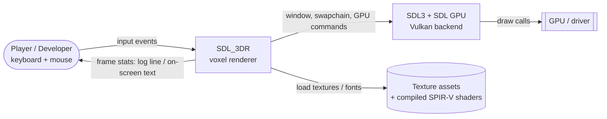
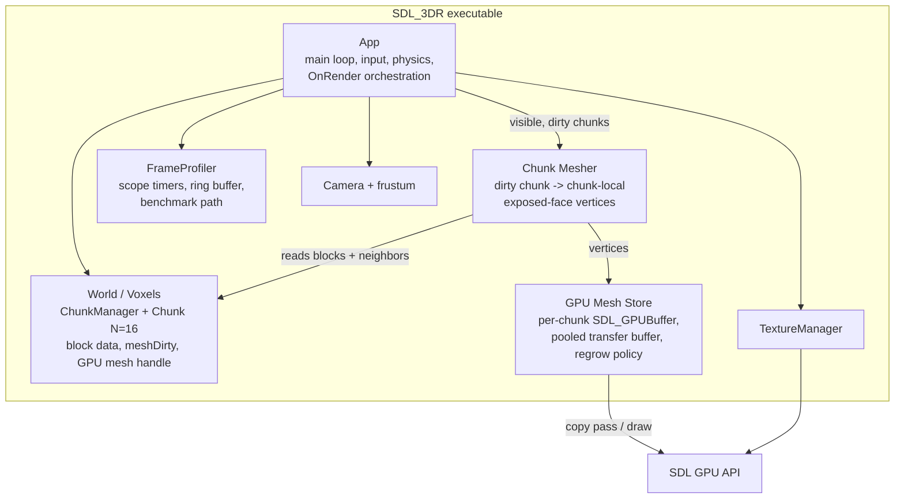

# High-Level Design: Dirty-Flag Per-Chunk GPU Meshes for SDL_3DR

## TL;DR
- Replace the broken CPU Face cache and per-frame full-scene rebuild/upload with **per-chunk dirty-flag meshes owned on the GPU** (one persistent `SDL_GPUBuffer` per chunk, rebuilt only when dirty).
- Chunk-level frustum culling replaces per-block culling; neighbor-aware hidden-face culling shrinks each mesh; neighbor chunks are dirtied on boundary edits.
- Staged order: measure (in-app timers, no build-config change) -> dirty flag -> GPU buffers -> neighbor culling. Block storage (`std::optional<Object>`) is left alone.
- Dependency-free (SDL3 + standard library). Confidence medium: nothing has been profiled, so every magnitude is unmeasured.

## Key Decisions
- Measurement: in-app per-stage timers plus a fixed benchmark camera path, no Release preset/CMake change; timings are relative-only if the build is Debug ([ADR-001](decision-log.md#adr-001-in-app-per-stage-timers-and-benchmark-path-without-build-config-change)).
- CPU cache: delete `ChunkMeshCache`/Face cache; per-chunk `meshDirty` with chunk-level culling ([ADR-002](decision-log.md#adr-002-replace-the-face-cache-with-a-per-chunk-dirty-flag)).
- GPU ownership: per-chunk persistent buffers, pooled transfer buffer, capacity+regrow policy ([ADR-003](decision-log.md#adr-003-per-chunk-persistent-gpu-vertex-buffers)).
- Culling: neighbor-aware cross-chunk face culling with chunk-local vertices and an explicit unloaded-neighbor policy ([ADR-004](decision-log.md#adr-004-neighbor-aware-cross-chunk-face-culling)).
- Layout: keep `std::optional<Object>` per block; revisit compact ids on stated triggers ([ADR-005](decision-log.md#adr-005-keep-stdoptionalobject-block-storage-for-now)).

## Open Questions / Risks
- All magnitudes unmeasured; if the build is Debug (likely), timers are relative-only and absolute conclusions (e.g. "is the frame GPU-bound?") are unreliable. Without a build-config change this risk is accepted; consider a Release run later as an out-of-band check.
- Thread safety of E-key edits vs parallel (`par`) meshing is unverified; the dirty flag must be consumed on a single thread or made atomic.
- Buffer lifetime: releasing/replacing a chunk `SDL_GPUBuffer` while a prior frame's command buffer still references it needs a deferred-release rule.
- Boundary policy for unloaded neighbors (air vs solid) changes visible faces at the world edge; must be stated and consistent.
- Per-chunk draw calls: trivial at 4 chunks, may need revisiting (indirect/suballocation) if chunk count grows.
- Toolchain mismatch (MinGW logs vs MSVC-triplet vcpkg) means the developer's real build may differ from what was analyzed.

## Design Overview
SDL_3DR is a single-executable C++23 voxel renderer on SDL3 GPU/Vulkan. Research found that its only cache (`Chunk::cache`, CPU world-space Faces) is inverted, never invalidated and camera-dependent, and that every frame still copies, flattens, regenerates 60 B vertices and re-uploads the whole scene through a fresh transfer buffer. The beneficiary is the single developer: the design supports both frame-rate headroom and the project's learning goals (profiling, mesh caching, culling).

The chosen approach moves the cache to the layer that matters. Each `Chunk` gains a `meshDirty` flag and a small GPU mesh handle (buffer, vertex count, capacity). A single-threaded remesh step regenerates only dirty chunks: it emits **chunk-local** vertices for **exposed faces only** (neighbor-aware, consulting adjacent chunks through `ChunkManager`), uploads through a **pooled transfer buffer**, and clears the flag. The render pass then frustum-tests whole chunks and issues one draw per visible chunk. Edits set the flag on the edited chunk and, at boundaries, on the adjacent chunk. A lightweight in-app **FrameProfiler** wraps each stage and reports avg/p95/max, and a fixed benchmark camera path makes runs comparable.

**Key decisions:**
- Dirty flag replaces the Face cache (removes stale/camera-dependent bug class by construction).
- Per-chunk persistent GPU buffers own the mesh (static chunks cost zero CPU mesh/upload work).
- Neighbor-aware culling replaces disabled, buggy in-chunk culling (fix z-guard typos first).
- Measurement first, without build-config changes or new dependencies.
- Block storage untouched until measurement demands change.

## Architecture

### System Context (C4 Level 1)

The system boundary is unchanged; the only new outward flow is frame-time statistics shown to the developer (log line per interval or on-screen text via existing SDL3_ttf).

### Container Overview (C4 Level 2)
The system is one executable; "containers" are its top-level runtime building blocks.

Containers marked new: Chunk Mesher, GPU Mesh Store, FrameProfiler (logical units; they may live inside existing classes or as small helpers, decided at specification).

## Key Components
| Component | Purpose | Responsibilities | Key Interfaces | Dependencies |
|---|---|---|---|---|
| App (existing) | Owns frame loop and GPU device | Orchestrate: frustum test, remesh dirty chunks, draw visible chunks; route edits to dirty marking; own the profiler | `OnRender`, edit path (E-key) | ChunkManager, Camera, GPU Mesh Store, FrameProfiler, TextureManager |
| ChunkManager / Chunk (existing, extended) | Own chunk data and mesh state | Store blocks; hold `meshDirty` and GPU mesh handle; neighbor lookup by chunk coordinate; mark self + boundary neighbors dirty on edit | `getChunk(coord)`, `markDirty`, `setBlock` | Object, Int3 |
| Chunk Mesher (new logical) | Turn blocks into vertices | Emit a face only where the neighbor cell is air; consult adjacent chunks at borders; apply unloaded-neighbor policy; output chunk-local vertices | `buildMesh(chunk, neighborView) -> vertex list` | ChunkManager (read-only) |
| GPU Mesh Store (new logical) | Own per-chunk GPU buffers | Create/regrow buffer to capacity; upload via pooled transfer buffer in a copy pass; defer release while in flight; free on unload | `upload(chunk, vertices)`, `release(chunk)` | SDL GPU device |
| FrameProfiler (new logical) | Measure per stage | Scope timers (frustum, remesh, upload, render), frame ms avg/p95/max, periodic report; drive benchmark camera path | `Scope(stage)`, `report()` | SDL timing, existing logging |
| Camera (existing) | View and frustum | Provide frustum planes for chunk-level AABB test; chunk-local vertices need per-chunk model offset (push/uniform) | `frustumPlanes()` | Matrix types |
| TextureManager (existing) | Block textures | Unchanged | bind texture | SDL_image |

## Data Flow
1. **Edit / generation:** world generation or an E-key edit changes block data; `Chunk::setBlock` sets `meshDirty` on the chunk and, if the cell is on a chunk boundary, on the adjacent chunk.
2. **Frame start:** App computes the frustum and, per chunk, a cheap AABB test -> visible set.
3. **Remesh (single-threaded step, before the render pass):** for each visible-or-nearby chunk with `meshDirty`, the Mesher builds chunk-local exposed-face vertices, reading neighbors through ChunkManager. GPU Mesh Store uploads them (pooled transfer buffer, one copy pass), updates vertex count/capacity, clears the flag.
4. **Render pass:** for each visible chunk with a non-empty mesh, set chunk offset, bind its buffer, draw. No CPU vertex work for clean chunks.
5. **Stats:** FrameProfiler times each stage and reports periodically.

Stored forms: block data (per chunk, CPU); vertex data (GPU only after upload; CPU copy transient). During staged rollout, stage 2 keeps the old scene-wide upload but regenerates CPU vertices only for dirty chunks (see Implementation Stages).

## Integration Points
- **App::OnRender:** the largest change; replaces cache lookup, flatten, Face->Vertex3D regeneration and the single scene upload with remesh + per-chunk draw.
- **Edit path (E-key, App.cpp edit block):** must call the dirty-marking API (new integration).
- **ChunkManager:** needs a neighbor accessor by chunk coordinate (existing `chunkMap`); also unload hook to release GPU buffers.
- **Shaders/pipeline:** chunk-local vertices require a per-chunk translation (uniform/push data); vertex layout can stay `Vertex3D` (compact/indexed layouts deferred).
- **SDL GPU:** buffer create/release, transfer buffer map, copy pass, deferred release; no new dependencies.
- **Logging/UI:** profiler output via existing logging macros or SDL3_ttf text.
- **Threading:** `std::execution::par` per-chunk meshing may remain only if each task owns its chunk output and the dirty flag is not raced (open risk).

## Implementation Stages and Verification
Order: measure -> dirty/cache -> GPU buffers -> culling. Each stage is shippable and re-measured with the benchmark path.

| Stage | Work | Verify |
|---|---|---|
| 0. Measure | FrameProfiler with per-stage scope timers, avg/p95/max frame ms, fixed benchmark camera path; no CMake/preset change. Record baseline (label it Debug/relative if applicable). | Two runs of the benchmark path agree within noise; stage timings sum to approx frame time; overhead of timers is small versus stage costs. |
| 1. (Optional stopgap) 2A correctness subset | Invalidate on edit; stop caching a frustum subset; initialize bitmap. Only if stage 2 is delayed. | Edit a block: visual change appears; turn camera: no missing chunks. |
| 2. Dirty-flag chunk mesh | Add `meshDirty`; remove `ChunkMeshCache`, `isValidCache`, `cachedBlockPresence`; chunk-level frustum test; neighbor dirtying on boundary edits; reserve/copy only for dirty chunks. | Static scene: remesh timer reads zero on clean frames; edit -> only edited (and boundary neighbor) chunk remeshes; no stale geometry after edits; image identical to baseline for a static view. |
| 3. Per-chunk GPU buffers | Per-chunk `SDL_GPUBuffer`, pooled transfer buffer, capacity + regrow, deferred release, per-chunk draw with chunk offset. | Upload timer zero on clean frames; camera motion triggers no upload; forced growth (add many blocks in one chunk) does not overflow or crash; run with validation layers if available; visuals match stage 2. |
| 4. Neighbor-aware culling | Fix z-guard typos (App.cpp ~1467, 1473) first; mesher consults neighbors; unloaded-neighbor policy; neighbor dirtying already in place. | Vertex count drops versus stage 3 on the benchmark path; no visible holes at chunk borders (walk along borders); edit at border re-meshes both chunks and reveals/hides faces correctly; world-edge faces follow the stated policy. |

## Design Decisions
| ADR | Decision | Alternatives (see solution-exploration.md) |
|---|---|---|
| [ADR-001](decision-log.md#adr-001-in-app-per-stage-timers-and-benchmark-path-without-build-config-change) | In-app per-stage timers + benchmark path, no build-config change | [Area 1](solution-exploration.md#decision-area-1-measurement-profiling-and-build-configuration) |
| [ADR-002](decision-log.md#adr-002-replace-the-face-cache-with-a-per-chunk-dirty-flag) | Dirty-flag chunk mesh replaces Face cache | [Area 2](solution-exploration.md#decision-area-2-fixing-the-cpu-chunk-cache) |
| [ADR-003](decision-log.md#adr-003-per-chunk-persistent-gpu-vertex-buffers) | Per-chunk persistent GPU buffers | [Area 3](solution-exploration.md#decision-area-3-gpu-side-mesh-ownership) |
| [ADR-004](decision-log.md#adr-004-neighbor-aware-cross-chunk-face-culling) | Neighbor-aware cross-chunk face culling | [Area 4](solution-exploration.md#decision-area-4-hidden-face-culling-and-meshing-strategy) |
| [ADR-005](decision-log.md#adr-005-keep-stdoptionalobject-block-storage-for-now) | Keep `std::optional<Object>` storage | [Area 5](solution-exploration.md#decision-area-5-chunk-data-layout) |

## Concrete Examples
1. **Static view, nothing edited.** Given the player stands still (or walks) and no block changed, when a frame renders, then no chunk is remeshed, no upload occurs, and the profiler shows remesh and upload stages at ~0 ms while draws equal the visible chunk count.
2. **Block edit at a chunk border.** Given the player removes a block on the x-boundary between chunk A and chunk B, when the next frame runs, then A and B are both marked dirty, remeshed and uploaded once, the newly exposed faces appear on both sides, and every other chunk is untouched.
3. **Chunk mesh grows past its buffer.** Given a chunk's vertex count exceeds its buffer capacity after edits, when it is remeshed, then the GPU Mesh Store allocates a larger buffer (deferring release of the old one until in-flight frames complete) and rendering continues without overflow.

## Out of Scope
- Build-config changes (Release/RelWithDebInfo presets, LTO) per the user's choice; external profilers (Tracy, RenderDoc, Nsight).
- Greedy meshing, indexed/compact/packed vertices, indirect/multi-draw, sub-allocated single buffer, texture atlas/mipmaps.
- Compact block ids/palette, RLE/octree storage.
- Real LOD with hysteresis, occlusion culling, streaming/eviction, threaded generation, lighting/AO.
- World-generation fixes (noise ignoring chunk offset), unrelated bugs (double `SDL_DestroySurface`, `atPos.y` used for z, empty line pass, integer FPS averaging).
- Concurrency review of `par_unseq` beyond what the dirty-flag/remesh step needs.
Deferred ideas are catalogued in [solution-exploration.md](solution-exploration.md).

## Success Criteria
- Clean frames (no edit) perform zero remesh and zero GPU upload work, verified by profiler stage timers.
- Camera motion alone triggers no mesh rebuild or upload.
- A block edit re-meshes only the edited chunk plus boundary neighbors, with no stale or missing geometry.
- Total scene vertex count on the benchmark path drops after neighbor culling with no visible holes at chunk borders.
- Frame time (avg and p95) on the fixed benchmark path improves versus the stage-0 baseline, compared within the same build configuration.
- No vertex buffer overflow when a chunk's mesh grows.
